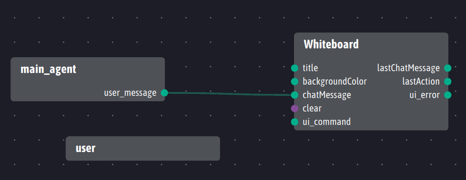

# interaction-distribuee
TP 3A UPSSITECH 

# Mise en place de l’environnement du projet

Il est nécessaire de mettre en place l’environnement du projet avant de le lancer. Plusieurs outils doivent être lancés :

- Ingescape Circle, nécessaire à l’observation des différents agents. Il est également nécessaire de le démarrer sur un certain réseau/port pour observer sur ces derniers ;

- L’application whiteboard, dont l’agent devrait apparaitre sur Ingescape Circle comme sur la capture ci-dessous : 

- Dans le dossier du projet, le Main_agent doit être démarré sur le même réseau et le même port qu’Ingescape Circle et le whiteboard, et sa sortie doit être liée à l’input chatMessage du Whiteboard comme sur la capture d’écran ci-dessous : 

    Pour Windows :
    ```
    python main.py main_agent Wi-Fi 5670
    ```
    Pour les systeme Unix :
    ```
    python3 main.py main_agent wlo1 5670
    ```

- Dans le dossier du projet, démarrer un agent User<br />
    Pour Windows :
    ```
    python main.py user Wi-Fi 5670
    ``` 
    Pour les systeme Unix :
    ```
    python3 main.py user wlo1 5670
    ```
    cet agent devrait être visible sur Ingescape circle, et son interface graphique devrait également apparaitre. <br />
    
    

- Il devrait maintenant être possible d’écrire des messages sur le whiteboard via l’interface utilisateur, en entrant d’abord un pseudo, puis un message avant d’appuyer sur envoyer. Il est possible d’instancier plusieurs utilisateurs tant que les agents sont créés sur le même réseau et le même port.

- Enfin, un fichier main permet de lancer l'agent `main_agent` et un ou plusieurs agent `user` avec : <br />
Pour Windows 
    ```
    python main_launch.py python Wi-Fi 5670 <nombre d'agent user à lancer>
    ```
    Pour les systeme Unix :
    ```
    python3 main_launch.py python3 wlo1 5670 <nombre d'agent user à lancer>
    ```

    Donc `python3 main_launch.py python3 wlo1 5670 3` lance l'agent main et deux agent `user`.

