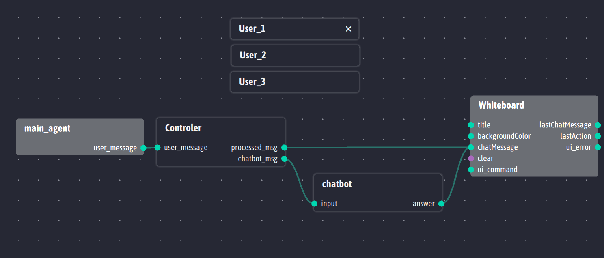

# interaction-distribuee
# TP 3A UPSSITECH 

## Pré-requis

Pour utiliser ce projet les bibliothèques python suivantes sont nécessaires :
- ingescape
- qtmodern
- PyQt5
- re
- nltk
- json

## Mise en place de l’environnement du projet

Il est nécessaire de mettre en place l’environnement du projet avant de le lancer. Plusieurs outils doivent être lancés :

- Ingescape Circle, nécessaire à l’observation des différents agents. Il est également nécessaire de le démarrer sur un certain réseau/port pour observer sur ces derniers

- L’application whiteboard, dont l’agent devrait apparaitre sur Ingescape Circle comme sur la capture ci-dessous : 

- Dans le dossier du projet, le `main_agent` doit être démarré sur le même réseau et le même port qu’Ingescape Circle et le whiteboard, et sa sortie doit être liée à l’input `raw_str` du contrôleur.


- Dans le dossier du projet, démarrer l’agent chatbot et l’agent contrôleur, puis les lier comme illustré sur la capture d’écran ci-dessous :

     <br />

    Depuis la racine du projet, dans un terminal :<br />
    Pour Windows :
    ```
    python main_agent\main.py main_agent Wi-Fi 5670
    ```
    ```
    python controler/main.py Controleur Wi-Fi 5670
    ```
    ```
    python chatbot/main.py chatbot Wi-Fi 5670
    ```
    Pour les systemes Unix :
    ```
    python3 main_agent/main.py main_agent wlo1 5670
    ```
    ```
    python3 controler/main.py Controleur wlo1 5670
    ```
    ```
    python3 chatbot/main.py chatbot wlo1 5670
    ```

- Dans le dossier du projet, démarrer un agent `user`. <br />
Depuis la racine du projet, dans un terminal :<br />
    Pour Windows :
    ```
    python User\main.py user Wi-Fi 5670
    ``` 
    Pour les systemes Unix :
    ```
    python3 User/main.py user wlo1 5670
    ```
    cet agent devrait être visible sur Ingescape circle, et son interface graphique devrait également apparaitre. <br />
    
    

- Il devrait maintenant être possible d’écrire des messages sur le whiteboard via l’interface utilisateur, en entrant d’abord un pseudo, puis un message avant d’appuyer sur envoyer. Il est possible d’instancier plusieurs utilisateurs tant que les agents sont créés sur le même réseau et le même port.

- Enfin, un fichier main permet de lancer les agents nécessaires et un ou plusieurs agent `user` avec : <br />
Depuis la racine du projet, dans un terminal :<br />
Pour Windows 
    ```
    python main_launch.py python Wi-Fi 5670 <nombre d'agent user à lancer>
    ```
    Pour les systemes Unix :
    ```
    python3 main_launch.py python3 wlo1 5670 <nombre d'agent user à lancer>
    ```

    Donc `python3 main_launch.py python3 wlo1 5670 3` lance l'agent main et deux agent `user`.

## Scenario d'utilisation

Deux utilisateurs utilise le Whiteboard pour communiquer et partager des images et des notes.


L'interface `user` de l'utilisateur *User_01* :


Et enfin Ingescape-Circle avec les agents :


